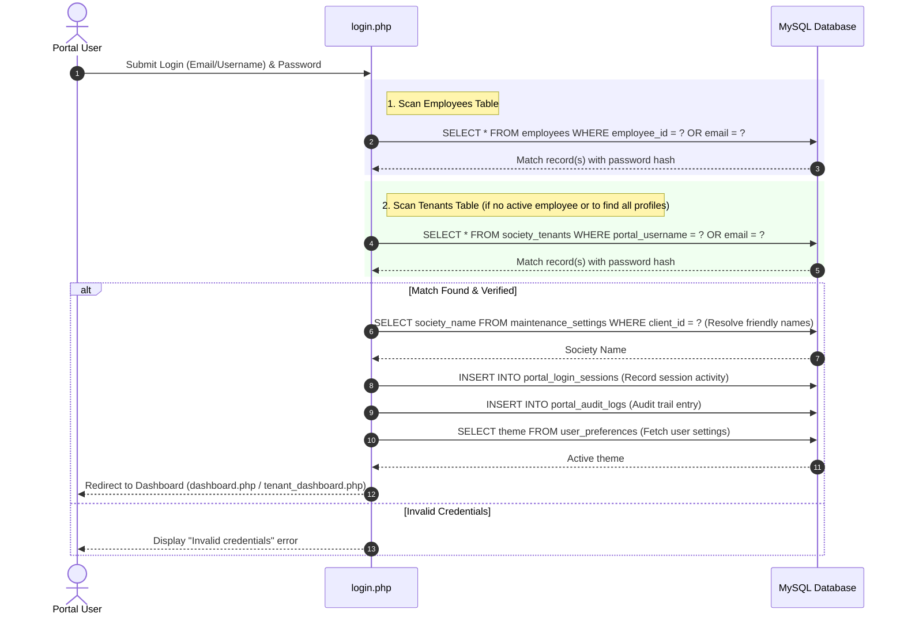
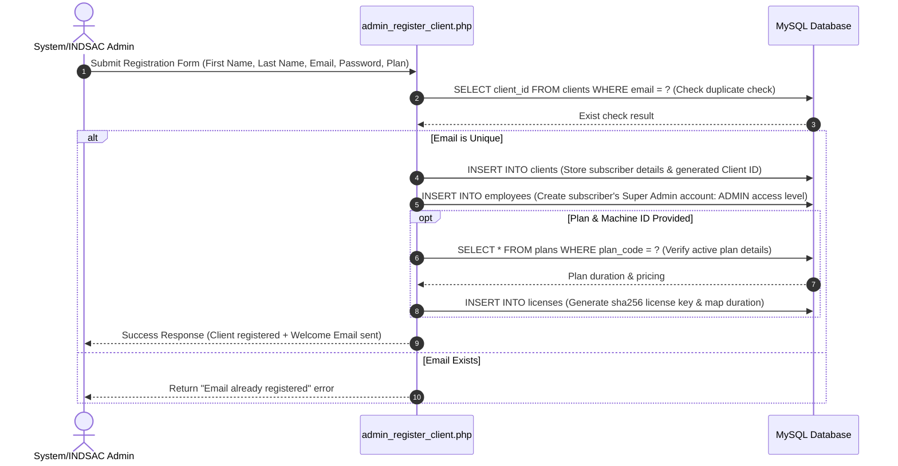
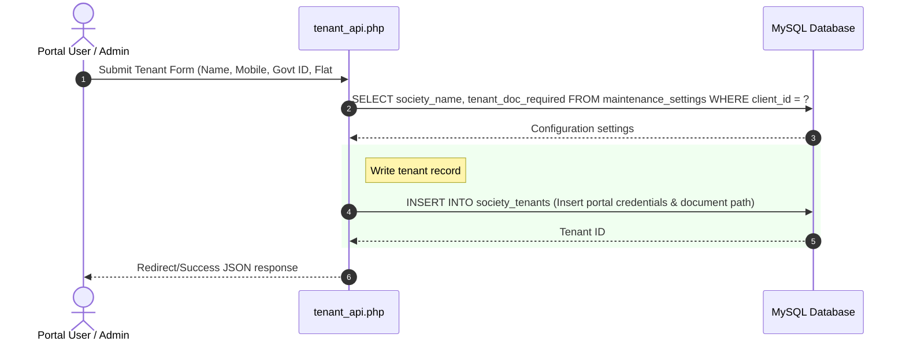
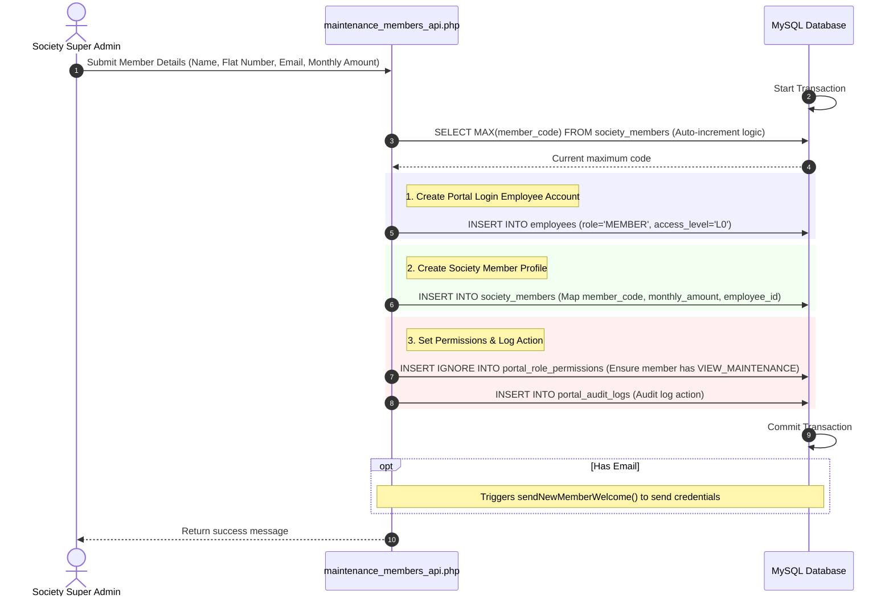

# Database Operations Flow Diagram

This document provides visual flowcharts mapping user interactions to the underlying MySQL database tables within the EyeSense Cloud Portal.

---

## 1. User Login Flow

When a user attempts to log in via the portal login page:

---

## 2. Client Signup / Registration Flow

When a new Client (Society Subscriber) signup or registration is triggered:

---

## 3. Tenant Addition Flow

When a new tenant is added to the system (by a member/self or an administrator):

---

## 4. Super Admin Adding Society Member Flow

When a Society Super Admin registers a new society member (flat owner/resident):

